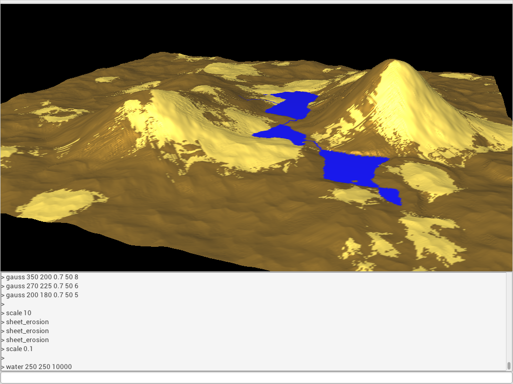

# plortz
Plortz is a software written in Java to generate rectangular areas of terrains suitable to be used in games etc. The terrains consists of data points to define the landscape elevation data and other attributes, such as the type of the land (for example dirt, sand, snow, water). These are commonly referred to as heightmaps.

Plortz has two user interfaces, the default graphical using JavaFX, and a commandline. The results can be written to Targa files. 

## Requirements
Java 11, LWJGL, LWJGUI, and Maven is used for build automation.

## Documentation:
* [User manual](documentation/manual.md)
* [Architecture](documentation/architecture.md)
* [Testing documentation](documentation/testing.md)
