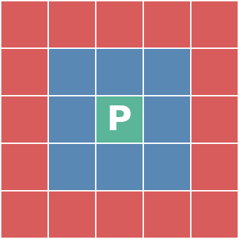

# Implementation goals

## The primary goal: produce terrains
The terrains can be generated via scripting, but to script, one has to know good parameters and tool combinations to use. Thus the users are going to use the graphical interactive user interface and its operating speed is important, user should not need to wait for minutes or hours for an operation to complete. Instead the operations should be near real-time. According to Nielsen, the operations should take less than 1 second, but a maximum of 10 seconds is tolerable: [Response Times: The 3 Important Limits by Jakob Nielsen](https://www.nngroup.com/articles/response-times-3-important-limits/).

The size of the terrain has a large impact because most tools operate on the whole terrain. The game in question greatly affects how large terrain is required, affecting factors include what kind of world the game depicts, how the world is viewed, and what kind of rendering techniques are used. Some games might have one large terrain spanning several square kilometers, with lot's of detail. Some games might have streaming and/or level system so that the size of a single terrain remains small, tens of square meters. If the terrain is viewed from the ground level, more detail is required than when viewing from higher altitudes. Some kind of middle ground is taken here, reference terrain size shall be 1024x1024 tiles.

## The secondary goal: real-time terrain generation in games
Practically all computer systems nowadays contains processors with multiple cores, so it is assumed that one CPU core can be used for terrain generation in real-time game. Games generating terrain in real-time do it in patches, and the performance requirement is based on how fast the player can move from one patch to another. Pre-generating patches in advance can give some room for performance stalls if the player is not constantly moving at maximum speed. The direction player is moving can be easily known in advance, or it might be somewhat random. When the system can not in advance know what is the next patch the player is going to, it needs to generate multiple patches at same time. Consider the following image of 5x5 patches, where player is in the green patch at the middle:

The blue patches are the ones the player could possibly move in the near future. One way to render the scene with patches aligned in 2d-grid like this, is to render two to four patches closest to the player, the green patch and one to three blue patches. The worst case scenario is that player moves diagonally, and five new patches need to be generated to anticipate the next move.

Usually in systems like this, the size of a single patch is considerably smaller than in a system where the whole playarea is in one patch, thus a smaller patch size is chosen as a reference: 512x512 tiles. Time available (product of size of a patch and the maximum speed of the player) to generate up to five patches is most likely going to be in the order of few seconds.
