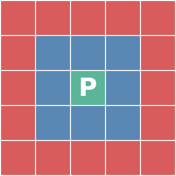

# Implementation

## The program structure
The program works on a rectangular area of terrain which has elevation and other data. The area is divided by square tiles, each tile containing information about the layers of soils underneath it. The data is modified using instances of tools. Only the top-most surface of the data will be in the generated output.

Looking from side, the following image depicts two tiles and their soil layers next to each other. Different soil layers are colored differently: 
Because each tile has its own soil layers, the soil layers are not connected between the tiles. While the tiles themselves can be thought to be square shaped when looking from top to down, in 3d applications they are usually rendered as being points, and a rectangle is rendered between four points (tiles) with smoothing.

There are two different user interface modes, a graphical user interface using JavaFX, and a console user interface reading commands from stdin and outputting to stdout. Both user interfaces use the same commands, which are constructed from the user supplied command strings. The commands use the tools to perform the actions. Most tools have a one-to-one mapping with a command.

## Performance
The important action happens inside the different tools. There are couple different ways to produce similar results, but there are no real overlapping of the tools created. Thus the performance testing does not try to achieve identical end products, but instead "usable" end products via different methods. A usable end product is something that would work as a terrain for some game.

The main goal of the project is to be able to produce terrains usable in games, secondary goal is to have the system operate fast enough for generating the terrains in real-time in the games.


### The main goal: produce terrains
The terrains can be generated via scripting, but to script, one has to know good parameters and tool combinations to use. Thus the users are going to use the interactive user interface and its operating speed is important, user should not need to wait for minutes or hours for an operation to complete. Instead the operations should be near real-time. According to Nielsen, the operations should take less than 1 second, but a maximum of 10 seconds is tolerable: [Response Times: The 3 Important Limits by Jakob Nielsen](https://www.nngroup.com/articles/response-times-3-important-limits/).

The size of the terrain has a large impact because most tools operate on the whole terrain. The game in question greatly affects how large terrain is required, affecting factors include what kind of world the game depicts, how the world is viewed, and what kind of rendering techniques are used. Some games might have one large terrain spanning several square kilometers, with lot's of detail. Some games might have streaming and/or level system so that the size of a single terrain remains small, tens of square meters. If the terrain is viewed from the ground level, more detail is required than when viewing from higher altitudes. Some kind of middle ground is taken here, reference terrain size shall be 1024x1024 tiles.


### Secondary goal: real-time terrain generation in games
Practically all computer systems nowadays contains processors with multiple cores, so it is assumed that one CPU core can be used for terrain generation in real-time game. Games generating terrain in real-time do it in patches, and the performance requirement is based on how fast the player can move from one patch to another. Pre-generating patches in advance can give some room for performance stalls if the player is not constantly moving at maximum speed. The direction player is moving can be easily known in advance, or it might be somewhat random. When the system can not in advance know what is the next patch the player is going to, it needs to generate multiple patches at same time. Consider the following image of 5x5 patches, where player is in the green patch at the middle:



The blue patches are the ones the player could possibly move in the near future. One way to render the scene with patches aligned in 2d-grid like this, is to render two to four patches closest to the player, the green patch and one to three blue patches. The worst case scenario is that player moves diagonally, and five new patches need to be generated to anticipate the next move.

Usually in systems like this, the size of a single patch is considerably smaller than in a system where the whole playarea is in one patch, thus a smaller patch size is chosen as a reference: 512x512 tiles. Time available (product of size of a patch and the maximum speed of the player) to generate up to five patches is most likely going to be in the order of few seconds.


### Measuring
The duration of executing the tools by commands are calculated using [java.time.Instant.now()](https://docs.oracle.com/en/java/javase/11/docs/api/java.base/java/time/Instant.html#now()), which uses system clock. System clock can go backwards and the resolution is not guaranteed, in practice the resolution on this computer and Java implementation is fine enough for the measuring purposes here. The possibility of clock going backwards is also ignored.

The graphical user interface uses JavaFX which runs two or more threads, one thread for the application and one or more threads for the renderer and media, see [JavaFX architecture](https://docs.oracle.com/javase/8/javafx/get-started-tutorial/jfx-architecture.htm#A1107438). When the program executes a command the terrain is updated, the JavaFX scene is updated, and the program calculates the time used. The user interface is then rendered a bit later in the other thread(s). The amount of time spent rendering is significant in 3d view, but is not visible in the timing information obtained by the program. Because the user interface is not responding while the rendering is performed, it must also be measured and taken into account. This is done using the built-in logger by starting with "javafx.pulseLogger=true". Example output of the pulse logger:
```
PULSE: 1 [0ms:276ms]
T19 (0 +143ms): CSS Pass
T19 (144 +13ms): Layout Pass
T19 (157 +1ms): Update bounds
T19 (159 +0ms): Waiting for previous rendering
T19 (159 +17ms): Copy state to render graph
T16 : Slow background path for null
T16 : Slow background path for null
T16 : Slow background path for null
T16 : Slow background path for null
T16 : Slow background path for null
T16 : Slow background path for null
T16 : Slow background path for null
T16 (192 +78ms): Painting
T16 (270 +6ms): Presenting
Counters:
        CacheFilter rebuilding: 1
        Cached region background image used: 4
        NGRegion renderBackgrounds slow path: 7
        Nodes rendered: 24
        Nodes visited during render: 31
        Rendering region background image to cache: 4
```
The most important bit is the first line ```PULSE: 1 [0ms:276ms]```, it means that this was the first event, 0ms after the previous, and it took 276ms in total. When there are multiple events occuring within a short period of time, the line ```T19 (159 +0ms): Waiting for previous rendering``` becomes also important, because time spent on waiting on previous rendering is not part of this rendering, and needs to be subtracted from the total, otherwise the same time is counted for multiple times.


## Algorithm complexities

### Smoothing filters
There are three different smoothing filters: average, median, and edge preserving. Average and median filters time complexity is ```O(nk^2)``` where ```n``` is the size of the terrain and ```k``` is the window size. The edge preserving filter has two passes, where the first pass uses a static window size of 3, and the second pass is average filter, thus the time complexity is ```O(9n+nk^2)```.
