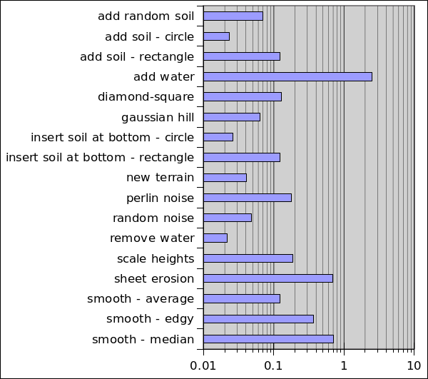

# Implementation

## The program structure

The program works on a rectangular area of terrain which has elevation and other data. The area is divided by square tiles, each tile containing information about the layers of soils underneath it. The data is modified using instances of tools. Only the top-most surface of the data will be in the generated output.

Looking from side, the following image depicts two tiles and their soil layers next to each other. Different soil layers are colored differently:


Because each tile has its own soil layers, the soil layers are not connected between the tiles. While the tiles themselves can be thought to be square shaped when looking from top to down, in 3d applications they are usually rendered as being points, and a rectangle is rendered between four points (tiles) with smoothing using normal vector for each point.

### User interfaces
There are two different user interface modes, a graphical user interface using JavaFX, and a console user interface reading commands from stdin and outputting to stdout. Both user interfaces use the same commands, which are constructed from the user supplied command strings. The commands use the tools to perform the actions. Most tools have a one-to-one mapping with a command.

### Architecture
The basic package architecture is shown below. The ```util``` and ```observer``` -packages contain common utilities used everywhere are not shown, also not shown are the sub-packages.


## Performance
The important action happens inside the different tools. There are couple different ways to produce similar results, but there are no real overlapping of the tools created. Thus the performance testing does not try to achieve identical end products, but instead "usable" end products via different methods. A usable end product is something that would work as a terrain for some game.

The primary goal of the project is to be able to pre-generate terrains to be used in games, secondary goal is to have the system operate fast enough for generating the terrains in real-time in the games.

### The primary goal: produce terrains
The terrains can be generated via scripting, but to script, one has to know good parameters and tool combinations to use. Thus the users are going to use the graphical interactive user interface and its operating speed is important, user should not need to wait for minutes or hours for an operation to complete. Instead the operations should be near real-time. According to Nielsen, the operations should take less than 1 second, but a maximum of 10 seconds is tolerable: [Response Times: The 3 Important Limits by Jakob Nielsen](https://www.nngroup.com/articles/response-times-3-important-limits/).

The size of the terrain has a large impact because most tools operate on the whole terrain. The game in question greatly affects how large terrain is required, affecting factors include what kind of world the game depicts, how the world is viewed, and what kind of rendering techniques are used. Some games might have one large terrain spanning several square kilometers, with lot's of detail. Some games might have streaming and/or level system so that the size of a single terrain remains small, tens of square meters. If the terrain is viewed from the ground level, more detail is required than when viewing from higher altitudes. Some kind of middle ground is taken here, reference terrain size shall be 1024x1024 tiles.


### The secondary goal: real-time terrain generation in games
Practically all computer systems nowadays contains processors with multiple cores, so it is assumed that one CPU core can be used for terrain generation in real-time game. Games generating terrain in real-time do it in patches, and the performance requirement is based on how fast the player can move from one patch to another. Pre-generating patches in advance can give some room for performance stalls if the player is not constantly moving at maximum speed. The direction player is moving can be easily known in advance, or it might be somewhat random. When the system can not in advance know what is the next patch the player is going to, it needs to generate multiple patches at same time. Consider the following image of 5x5 patches, where player is in the green patch at the middle:


The blue patches are the ones the player could possibly move in the near future. One way to render the scene with patches aligned in 2d-grid like this, is to render two to four patches closest to the player, the green patch and one to three blue patches. The worst case scenario is that player moves diagonally, and five new patches need to be generated to anticipate the next move.

Usually in systems like this, the size of a single patch is considerably smaller than in a system where the whole playarea is in one patch, thus a smaller patch size is chosen as a reference: 512x512 tiles. Time available (product of size of a patch and the maximum speed of the player) to generate up to five patches is most likely going to be in the order of few seconds.


### Measuring
The duration of executing the tools by commands are calculated using [java.time.Instant.now()](https://docs.oracle.com/en/java/javase/11/docs/api/java.base/java/time/Instant.html#now()), which uses system clock. System clock can go backwards and the resolution is not guaranteed, in practice the resolution on this computer and Java implementation is fine enough for the measuring purposes here. The possibility of clock going backwards is also ignored.

JavaFX rendering runs in a separate thread and can not be directly counted for, special tactics are used to obtain the JavaFX rendering times, see [Measuring JavaFX rendering times](measuring_javafx.md) for more information.


### Results

Testing was performed on a desktop computer with i7-7700 CPU, 64GiB memory, and [GTX750ti](https://en.wikipedia.org/wiki/GeForce_700_series) GPU with 2 GiB memory.

### The main goal: produce terrains
Testing is done in two phases, first is measured the user interface, and then the operations.

#### User interface
Updating the 3d view for 1024x1024 terrain takes approximately 2 seconds.

Rotating and moving in the 3d view is not smooth, and the size of the window affects it. Rotating and moving in the 3d view only updates the camera transformation. According to glxinfo the program uses approximately 200 MiB of GPU memory. Using one fourth size (512x512) the rotating and moving is still sluggish, and has noticeable hiccups. Going further down to 256x256 the rotating and moving is smooth.

Because only portion of the available GPU memory is used, and there are noticeable hiccups, it seems that JavaFX is doing some additional work behind the scenes when updating the camera. Intuitively this is barely usable.

#### Operations
The used scriptfile can be found from [scripts/perf-large.txt](../scripts/perf-large.txt), it was executed using the following command:
```
echo "run scripts/perf-large.txt" | mvn compile exec:java -Dexec.args="--timing --no-gui"
```
<table>
<tr>
<td><table>
  <tr><th>Operation</th>                        <th>Time</th></tr>
  <tr><td>add random soil</td>                  <td>0.070387s</td></tr>
  <tr><td>add soil - circle</td>                <td>0.023363s</td></tr>
  <tr><td>add soil - rectangle</td>             <td>0.120971s</td></tr>
  <tr><td>add water</td>                        <td>26.747692s</td></tr>
  <tr><td>diamond-square</td>                   <td>0.126948s</td></tr>
  <tr><td>gaussian hill</td>                    <td>0.064253s</td></tr>
  <tr><td>insert soil at bottom - circle</td>   <td>0.025869s</td></tr>
  <tr><td>insert soil at bottom - rectangle</td><td>0.122741s</td></tr>
  <tr><td>new terrain</td>                      <td>0.040948s</td></tr>
  <tr><td>perlin noise</td>                     <td>0.177125</td></tr>
  <tr><td>random noise</td>                     <td>0.047644s</td></tr>
  <tr><td>remove water</td>                     <td>0.0219s</td></tr>
  <tr><td>scale heights</td>                    <td>0.187417s</td></tr>
  <tr><td>sheet erosion</td>                    <td>0.686428s</td></tr>
  <tr><td>smooth - average</td>                 <td>0.123293s</td></tr>
  <tr><td>smooth - edgy</td>                    <td>0.363429s</td></tr>
  <tr><td>smooth - median</td>                  <td>0.712419s</td></tr>
</table></td>
<td>Time taken by operations, logarithmic scale</td>
</tr>
</table>
Apart from the water adding operation, all operations finish in less than 1 second.

### Secondary goal: real-time terrain generation in games
The used scriptfile can be found from [scripts/perf-small.txt](../scripts/perf-small.txt), it was executed using the following command:
```
echo "run scripts/perf-small.txt" | mvn compile exec:java -Dexec.args="--timing --no-gui"
```
<table>
  <tr><th>Description</th><th>Time</th></tr>
  <tr><td>General landscape with perlin noise</td> <td>1.554698s</td></tr>
  <tr><td>General landscape with diamond-square</td> <td>0.500796s</td></tr>
  <tr><td>Couple hills with perlin noise base</td> <td>1.389787s</td></tr>
  <tr><td>Couple hills with diamond-square base</td> <td>0.45171s</td></tr>
  <tr><td>Couple hills and water with perlin noise base</td> <td>43.961907s</td></tr>
  <tr><td>Couple hills and water with diamond-square base</td> <td>50.062579s</td></tr>
</table>


## Algorithm complexities
Below are some of the time and space complexities of some of the used algorithms.

### Smoothing filters
There are three different smoothing filters: average, median, and edge preserving. Average and median filters time complexity is ```O(nk^2)``` where ```n``` is the size of the terrain and ```k``` is the window size. The edge preserving filter has two passes, where the first pass uses a static window size of 3, and the second pass is the average filter, time complexity for the first pass is ```O(n)```.

### Containers
PriorityQueue operations ```size()```, ```clear()```, and ```peek()``` are ```O(1)```, operations ```offer()``` and ```poll()``` are ```O(log n)```.

Merge sort time complexity is ```O(n log n)```, but it has a space complexity of ```O(n)```.

ListSet operations ```size()```, and ```clear()``` are ```O(1)```, operations ```add()```, ```remove()```, and ```contains()``` are ```O(n)```.

HashSet operations ```size()``` and ```isEmpty()``` are ```O(1)```, operations ```add()```, ```remove()```, and ```contains()``` are ```O(n)```.

HashMap operations ```size()``` and ```isEmpty()``` are ```O(1)```, operations ```put()```, ```get()```, ```remove()```, ```containsKey()```, and ```containsValue()``` are ```O(n)```.

ArrayList operations ```size()```, ```add(e)```, ```clear()```, ```get()```, and ```set()``` are ```O(1)```, operations ```add(i, e)```, ```remove()```, and ```indexOf()``` are ```O(n)```.

### Other algorithms
MersenneTwister is ```O(n)``` where ```n``` is the degree of recurrence, with the chosen MT19937 parameters ```n=624```, while the amortized time is ```O(1)```.


## Comparing the performance of similar classes
This project has some classes that implement the same interface, and thus can be used interchangeably. Some of these classes are made with some specific use case(s) in mind in order to optimize the performance. Simple benchmarking system was added to the project and some of these classes are benchmarked using it. The table below lists the results:
<table>
  <tr><th>Interface</th><th>Test</th>           <th>Class</th>               <th>Time (ns)</th>  </tr>
  <tr><td>List</td>     <td>Append at end</td>  <td>ArrayList</td>           <td>1137512</td>    </tr>
  <tr><td></td>         <td></td>               <td>FastInsertAppendList</td><td>1637319</td>    </tr>
  <tr><td></td>         <td>Insert at start</td><td>ArrayList</td>           <td>17463111181</td></tr>
  <tr><td></td>         <td></td>               <td>FastInsertAppendList</td><td>1331947</td>    </tr>
</table>


## Putting it all together, flaws and improvements

### Performance
The individual operations can be considered fast enough for the purposes, except the water adding tool with larger water amounts. The water adding procedure mimics what I intuitively think is water flowing, and while it gives nice results, the implementation is slow. The slowness comes mainly from the way the lakes are filled. When the lake size is increased the water is levelled to the new height, and then the system tries to start a river from the lowest dry land position. This usually expands the river only few tiles, and the whole lake is then again passed. This is repeated a lot with small increments to the height (depth) of the lake. It could probably be sped up by making a first rough approximation of the size of the lake to be filled, and then finish up with the precise measures.

When generating terrains with the perlin noise, multiple passes of different "octaves" (as they're commonly referred to) are needed. Diamond-square gives approximately same results with just one pass, also a single diamond-square pass is a bit faster than perlin noise. The perlin noise is a bit more versatile though, and can be combined with the diamond-square algorithm.

For the primary goal the 3d terrain view is the bottleneck, it seems like the culprit is the JavaFX 3d system as updating even a single value in the terrain data (be it in the beginning or the end) causes a delay that is as long as the initial creation of the 3d terrain. The user experience could be improved with the current system by keeping the 3d terrain view in small chunks, and then update the chunks over time with delays, that way the user would see slow update but the user interface would not completely stall for the duration of the update. However that would increase the total time needed for each update, and in order to fully fix the very slow updates the JavaFX 3d system would need to be changed to something else, the [Lightweight Java Game Library](https://www.lwjgl.org/) would probably be a good choice. Switching to LWJGL might also require switching away from JavaFX.

With the secondary goal, the terrain generation with the example cases varies between 0.5 and 1.5 seconds (again ignoring the very slow water adding system). In the worst case scenario, the maximum number of terrains needed is five, which brings the total time up to about 7.5 seconds. The size of those terrains are about 500x500, and assuming one unit is one meter, they cover about 500 meters in one direction. The maximum (5) number of terrains is needed when the player moves diagonally, which is about 1.4*500=700 meters. Thus if the players maximum speed is approximately 700m/7.5s=93 meters per second, the terrain generation is fast enough.

### User interface
The graphical user interface is very bare bones, and would greatly benefit from proper user interface elements instead of the stdin/stdout style console. More user friendly commands should also be created, with good default values and combinations of tools. Also the ability to point and click on the terrain to position the wanted effect would help users a lot. Nice advanced user interface is not part of the course, so it was deliberately left on low priority.

### Others
The sheet erosion and water adding tools are currently the only tools that emulates some kind of physics. It would be interesting to add more tools that mimic physics in some way. There could be more different types of erosions: wind erosion, water erosion (from the rivers), and shoreline erosion (lakes and sea).

With some soil types, the angle of repose should vary whether the soil is under water, moist, or dry. Together with the different types of erosions this would probably create interesting results.

New types of soils would be great additions. And they should be read from a resource file instead of being hard-coded into the Java source file.
