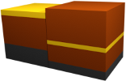

# Implementation

## The program structure
The program works on a rectangular area of terrain which has elevation and other data. The area is divided by square tiles, each tile containing information about the layers of soils underneath it. The data is modified using instances of tools. Only the top-most surface of the data will be in the generated output.

Looking from side, the following image depicts two tiles and their soil layers next to each other. Different soil layers are colored differently: 
Because each tile has its own soil layers, the soil layers are not connected between the tiles. While the tiles themselves can be thought to be square shaped when looking from top to down, in 3d applications they are usually rendered as being points, and a rectangle is rendered between four points (tiles) with smoothing.

There are two different user interface modes, a graphical user interface using JavaFX, and a console user interface reading commands from stdin and outputting to stdout. Both user interfaces use the same commands, which are constructed from the user supplied command strings. The commands use the tools to perform the actions. Most tools have a one-to-one mapping with a command.

