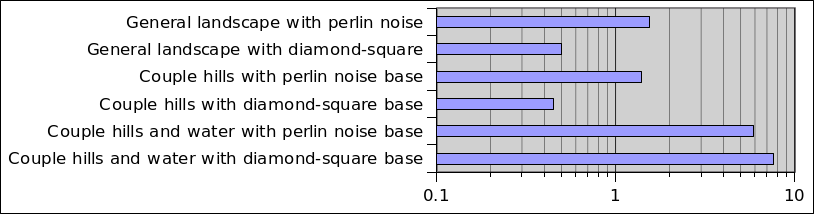

# Performance

## Measuring
The duration of executing the tools by commands are calculated using [java.time.Instant.now()](https://docs.oracle.com/en/java/javase/11/docs/api/java.base/java/time/Instant.html#now()), which uses system clock. System clock can go backwards and the resolution is not guaranteed, in practice the resolution on this computer and Java implementation is fine enough for the measuring purposes here. The possibility of clock going backwards is also ignored.

JavaFX rendering runs in a separate thread and can not be directly counted for, special tactics are used to obtain the JavaFX rendering times, see [Measuring JavaFX rendering times](measuring_javafx.md) for more information.


## Results

Testing was performed on a desktop computer with i7-7700 CPU, 64GiB memory, and [GTX750ti](https://en.wikipedia.org/wiki/GeForce_700_series) GPU with 2 GiB memory.

### The main goal: produce terrains
Testing is done in two phases, first is measured the user interface, and then the operations.

#### User interface
Updating the 3d view for 1024x1024 terrain takes approximately 2 seconds.

Rotating and moving in the 3d view is not smooth, and the size of the window affects it. Rotating and moving in the 3d view only updates the camera transformation. According to glxinfo the program uses approximately 200 MiB of GPU memory. Using one fourth size (512x512) the rotating and moving is still sluggish, and has noticeable hiccups. Going further down to 256x256 the rotating and moving is smooth.

Because only portion of the available GPU memory is used, and there are noticeable hiccups, it seems that JavaFX is doing some additional work behind the scenes when updating the camera. Intuitively this is barely usable.

### Operations
The used scriptfile can be found from [scripts/perf-large.txt](../scripts/perf-large.txt), it was executed using the following command:
```
echo "run scripts/perf-large.txt" | mvn compile exec:java -Dexec.args="--timing --no-gui"
```
<table>
<tr>
<td><table>
  <tr><th>Operation</th>                        <th>Time</th></tr>
  <tr><td>add random soil</td>                  <td>0.070387s</td></tr>
  <tr><td>add soil - circle</td>                <td>0.023363s</td></tr>
  <tr><td>add soil - rectangle</td>             <td>0.120971s</td></tr>
  <tr><td>add water</td>                        <td>2.485424s</td></tr>
  <tr><td>diamond-square</td>                   <td>0.126948s</td></tr>
  <tr><td>gaussian hill</td>                    <td>0.064253s</td></tr>
  <tr><td>insert soil at bottom - circle</td>   <td>0.025869s</td></tr>
  <tr><td>insert soil at bottom - rectangle</td><td>0.122741s</td></tr>
  <tr><td>new terrain</td>                      <td>0.040948s</td></tr>
  <tr><td>perlin noise</td>                     <td>0.177125</td></tr>
  <tr><td>random noise</td>                     <td>0.047644s</td></tr>
  <tr><td>remove water</td>                     <td>0.0219s</td></tr>
  <tr><td>scale heights</td>                    <td>0.187417s</td></tr>
  <tr><td>sheet erosion</td>                    <td>0.686428s</td></tr>
  <tr><td>smooth - average</td>                 <td>0.123293s</td></tr>
  <tr><td>smooth - edgy</td>                    <td>0.363429s</td></tr>
  <tr><td>smooth - median</td>                  <td>0.712419s</td></tr>
</table></td>
<td>Time taken by operations, logarithmic scale</td>
</tr>
</table>
Apart from the water adding operation, all operations finish in less than 1 second.

## Secondary goal: real-time terrain generation in games
The used scriptfile can be found from [scripts/perf-small.txt](../scripts/perf-small.txt), it was executed using the following command:
```
echo "run scripts/perf-small.txt" | mvn compile exec:java -Dexec.args="--timing --no-gui"
```
<table>
  <tr><th>Description</th><th>Time</th></tr>
  <tr><td>General landscape with perlin noise</td> <td>1.554698s</td></tr>
  <tr><td>General landscape with diamond-square</td> <td>0.500796s</td></tr>
  <tr><td>Couple hills with perlin noise base</td> <td>1.389787s</td></tr>
  <tr><td>Couple hills with diamond-square base</td> <td>0.45171s</td></tr>
  <tr><td>Couple hills and water with perlin noise base</td> <td>5.879849s</td></tr>
  <tr><td>Couple hills and water with diamond-square base</td> <td>7.638568s</td></tr>
</table>




## Algorithm complexities
Below are some of the time and space complexities of some of the used algorithms.

### Smoothing filters
There are three different smoothing filters: average, median, and edge preserving. Average and median filters time complexity is ```O(nk^2)``` where ```n``` is the size of the terrain and ```k``` is the window size. The edge preserving filter has two passes, where the first pass uses a static window size of 3, and the second pass is the average filter, time complexity for the first pass is ```O(n)```.

### Containers
PriorityQueue operations ```size()```, ```clear()```, and ```peek()``` are ```O(1)```, operations ```offer()``` and ```poll()``` are ```O(log n)```.

Merge sort time complexity is ```O(n log n)```, but it has a space complexity of ```O(n)```.

ListSet operations ```size()```, and ```clear()``` are ```O(1)```, operations ```add()```, ```remove()```, and ```contains()``` are ```O(n)```.

HashSet operations ```size()``` and ```isEmpty()``` are ```O(1)```, operations ```add()```, ```remove()```, and ```contains()``` are ```O(n)```.

HashMap operations ```size()``` and ```isEmpty()``` are ```O(1)```, operations ```put()```, ```get()```, ```remove()```, ```containsKey()```, and ```containsValue()``` are ```O(n)```.

ArrayList operations ```size()```, ```add(e)```, ```clear()```, ```get()```, and ```set()``` are ```O(1)```, operations ```add(i, e)```, ```remove()```, and ```indexOf()``` are ```O(n)```.

### Other algorithms
MersenneTwister is ```O(n)``` where ```n``` is the degree of recurrence, with the chosen MT19937 parameters ```n=624```, while the amortized time is ```O(1)```.


## Comparing the performance of similar classes
This project has some classes that implement the same interface, and thus can be used interchangeably. Some of these classes are made with some specific use case(s) in mind in order to optimize the performance. Simple benchmarking system was added to the project and some of these classes are benchmarked using it. The table below lists the results:
<table>
  <tr><th>Interface</th><th>Test</th>           <th>Class</th>         <th>Time (ns)</th>  </tr>
  <tr><td>List</td>     <td>Append at end</td>  <td>ArrayList</td>     <td>1137512</td>    </tr>
  <tr><td></td>         <td></td>               <td>FastInsertList</td><td>1637319</td>    </tr>
  <tr><td></td>         <td>Insert at start</td><td>ArrayList</td>     <td>17463111181</td></tr>
  <tr><td></td>         <td></td>               <td>FastInsertList</td><td>1331947</td>    </tr>
</table>
