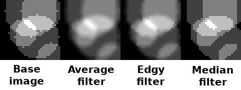

# Testing

## Unit testing
JUnit is used for unit testing. The tests can be run with:
```
mvn test
```

### Code coverage
Code coverage report can be generated using Jacoco:
```
mvn jacoco:report
```
The user interface code (everything under plortz.ui) is excluded from the code coverage report.

There is a lack of unit tests performed on certain areas that are considered unimportant:
* The main class responsible of starting the program.
* Not implemented methods, that just throw an "UnsupportedOperation" exception.
* Overrides of toString() method, those are used only for debugging purposes.
* Some simple getter and setter methods.


## Manual testing
Manual testing has been performed both using the command line and the graphical user interface. The command line allows to script the testing more easily, whereas the use of the graphical user interface allows to spot issues in the results more easily.

Testing with the command line is best done with script files executed with the ```run``` command, so that the command and its execution time are both printed out:
```
$ cat scriptfile.txt 
# This is a test scriptfile
random_seed 42
new 1025 1025
ds 13
$ echo 'run scriptfile.txt' | mvn --quiet compile exec:java -Dexec.args="--no-gui --timing"
> # This is a test scriptfile
> random_seed 42
> new 1025 1025
Execution time: PT0.156988S
> ds 13
Execution time: PT0.278227S
$ 
```


## Comparing algorithms

### Smoothing filters
There are three different smoothing filters: average, median, and edge preserving. They produce slightly different results which can be seen in the examples below:



The above images were created with the following script:
```
# Base image:
random_seed 0
new 30 30
random_soil 5 10 1
save heightmap filter-base.tga

# Average filter:
random_seed 0
new 30 30
random_soil 5 10 1
smooth average 3
save heightmap filter-average.tga

# Edge preserving filter:
random_seed 0
new 30 30
random_soil 5 10 1
smooth edgy 3
save heightmap filter-edgy.tga

# Median filter:
random_seed 0
new 30 30
random_soil 5 10 1
smooth median 3
save heightmap filter-median.tga
```
